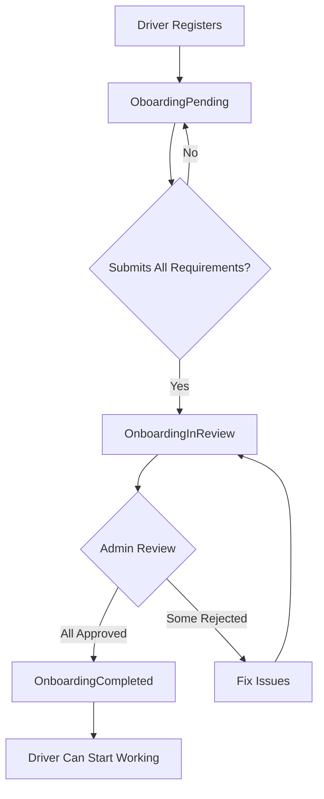

# Admin Driver Onboarding Approval - API Documentation

## Overview

The admin driver approval system provides a workflow for reviewing and approving **individual driver onboarding** requirements. Admin reviews one driver at a time, including their documents, truck (if applicable), and overall approval status.

## Driver Onboarding Process

### 1. **Driver Submits Requirements**
- Driver registers and accepts terms & conditions
- Driver uploads profile picture/passport
- Driver adds DOT number (US drivers only)
- Driver uploads required documents
- Driver adds their truck (optional - for driver-owned trucks)
- Status: `OboardingPending` → `OnboardingInReview`

### 2. **Admin Reviews Individual Driver**
- Admin opens specific driver's profile
- Reviews that driver's documents (can approve individually or in batch)
- Reviews that driver's truck (if they have one)
- Approves driver when all requirements are met
- Status: `OnboardingInReview` → `OnboardingCompleted`

## Available APIs

### **Driver Management APIs**

#### 1. Get Driver Details
```http
GET /api/Admin/driversbyId?driverId={driverId}
```

#### 2. Update Driver Onboarding Status
```http
PATCH /api/Admin/drivers/onboarding-status?driverId={driverId}
```
**Authorization:** `admin`, `manager`

**Request Body:**
```json
{
  "onboardingStatus": "OboardingPending|OnboardingInReview|OnboardingCompleted",
  "reason": "string (optional)"
}
```

#### 3. Complete Driver Approval
```http
POST /api/Admin/drivers/{driverId}/complete-approval
```
**Authorization:** `admin`, `manager`

**Description:** Automatically approves driver if all their requirements are met, otherwise returns validation errors.

**Response:**
```json
{
  "isSuccessful": true,
  "message": "Driver approved successfully",
  "data": true
}
```

### **Document Management APIs**

#### 1. Individual Document Approval
```http
PUT /api/DriverDocuments/approve/{documentId}
```
**Authorization:** `admin`, `manager` *(Fixed - was previously unsecured)*

#### 2. Individual Document Rejection
```http
PUT /api/DriverDocuments/reject/{documentId}
```
**Authorization:** `admin`, `manager` *(Fixed - was previously unsecured)*

**Request Body:**
```json
"Rejection reason here"
```

#### 3. Batch Approve Driver Documents
```http
POST /api/Admin/documents/batch-approve
```
**Authorization:** `admin`, `manager`

**Description:** Approve multiple documents for a specific driver at once.

**Request Body:**
```json
{
  "documentIds": ["doc1", "doc2", "doc3"]
}
```

**Response:**
```json
{
  "isSuccessful": true,
  "data": {
    "totalRequested": 3,
    "successfullyProcessed": 3,
    "failed": 0,
    "successfulIds": ["doc1", "doc2", "doc3"],
    "errors": [],
    "autoApprovedDrivers": ["driver123"]
  }
}
```

#### 4. Batch Reject Driver Documents
```http
POST /api/Admin/documents/batch-reject
```
**Authorization:** `admin`, `manager`

**Description:** Reject multiple documents for a specific driver with a reason.

**Request Body:**
```json
{
  "documentIds": ["doc1", "doc2"],
  "rejectionReason": "Documents are blurry and unreadable"
}
```

#### 5. Get Driver Documents
```http
GET /api/DriverDocuments/{driverId}
```
**Authorization:** All authenticated users

### **Truck Management APIs**

#### 1. Individual Truck Approval
```http
POST /api/Truck/UpdateApprovalStatusEnhanced?truckId={truckId}
```
**Authorization:** `admin`

**Request Body:**
```json
{
  "approvalStatus": "Approved|NotApproved|Blocked",
  "rejectionReason": "string (required for rejection)"
}
```


## Approval Workflow Logic

### **Auto-Approval Criteria**

A driver can be automatically approved to `OnboardingCompleted` status when:

1. ✅ **Terms & Conditions:** Accepted latest version
2. ✅ **Profile Picture:** Uploaded (passport/photo)
3. ✅ **DOT Number:** Provided (US drivers only)
4. ✅ **Required Documents:** All approved
5. ✅ **Truck:** Approved (if driver owns a truck)




## Admin Workflow for Driver Review

### **Reviewing Individual Driver**

1. **Get Driver Details:** `GET /api/Admin/driversbyId?driverId={id}`
2. **Review Documents:** Use individual or batch document approval
3. **Review Truck:** Use individual truck approval (if driver has one)
4. **Complete Approval:** Use auto-approval when all requirements met

### **Common Review Scenarios**

#### **Scenario 1: All Driver's Documents Look Good**
```http
# 1. Get driver details first
GET /api/Admin/driversbyId?driverId=123

# 2. Batch approve all the driver's documents
POST /api/Admin/documents/batch-approve
{
  "documentIds": ["doc1", "doc2", "doc3"]
}

# 3. Approve driver's truck if applicable
POST /api/Truck/UpdateApprovalStatusEnhanced?truckId=truck1
{
  "approvalStatus": "Approved"
}

# 4. Complete driver approval
POST /api/Admin/drivers/123/complete-approval
```

#### **Scenario 2: Some of Driver's Documents Need Rejection**
```http
# 1. Approve good documents for this driver
POST /api/Admin/documents/batch-approve
{
  "documentIds": ["doc1", "doc3"]
}

# 2. Reject problematic documents for this driver
POST /api/Admin/documents/batch-reject
{
  "documentIds": ["doc2"],
  "rejectionReason": "Document is expired"
}

# 3. Driver status remains OnboardingInReview until driver fixes issues
```

#### **Scenario 3: Individual Document Review for Driver**
```http
# 1. Get driver details
GET /api/Admin/driversbyId?driverId=123

# 2. Review each document individually
PUT /api/DriverDocuments/approve/doc1
PUT /api/DriverDocuments/reject/doc2
# (with rejection reason in body)

# 3. Complete approval when all requirements met
POST /api/Admin/drivers/123/complete-approval
```

## Error Handling

All APIs return standardized error responses:

```json
{
  "isSuccessful": false,
  "message": "Error description",
  "statusCode": 400,
  "data": null
}
```

### **Common Error Scenarios**

- **400 Bad Request:** Invalid request data, missing required fields
- **401 Unauthorized:** Missing or invalid authentication token
- **403 Forbidden:** Insufficient permissions for role
- **404 Not Found:** Driver, document, or truck not found
- **500 Internal Server Error:** Server-side processing error

## Security Considerations

1. **Role-Based Access:** All admin endpoints require `admin` or `manager` roles
2. **Input Validation:** All request parameters are validated
3. **Audit Trail:** All approval actions should be logged (implement in service layer)
4. **File Access:** Document URLs should be secured and time-limited

## Implementation Notes

### **Service Layer Methods Needed**

The following service methods need to be implemented:

**IAdminService:**
- `GetPendingApprovalsAsync()`

**IDriverDocumentService:**
- `BatchApproveDocumentsAsync(List<string> documentIds)`
- `BatchRejectDocumentsAsync(List<string> documentIds, string reason)`

**ITruckService:**
- `BatchApproveTrucksAsync(List<string> truckIds)`
- `BatchRejectTrucksAsync(List<string> truckIds, string reason)`

**IDriverService:**
- `CompleteDriverApprovalAsync(string driverId)`
- `GetDriversPendingReviewAsync(int pageNumber, int pageSize)`

Each service method should include:
- Transaction handling for batch operations
- Auto-approval logic when all requirements are met
- Proper error handling and validation
- Audit logging (recommended)

This comprehensive API set provides admins with both granular control and efficient batch operations for managing the driver approval process.